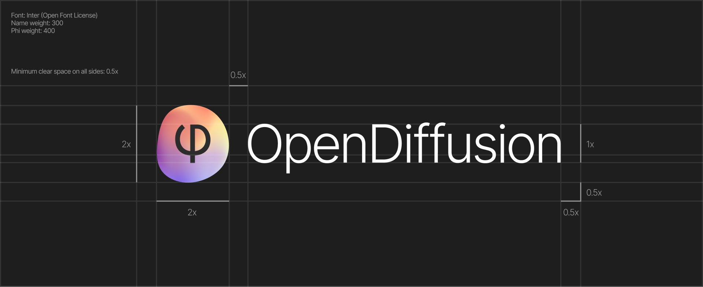

# Logos

This folder contains the SVGs of the regular OpenDiffusion logo and this short guide on how to use them properly.

## RGB Versions

### Main.svg

This is the main logo file which should be used as long as there's enough space.
The colors and the overall shape may be adapted (animated, changed, etc.)

**Always mind the 0.5x clear space on all sides!**

### Reduced.svg

This version can be used when there is not enough space for the text. However, the phi should always be visible and - more importantly - readable.

### Tiny.svg

If the logo type from the main version doesn't fit and the phi in the second logo would be too small to read, use this version. The name "OpenDiffusion" should be mentioned somewhere else in this case (for example the browser favicon where the name of the page supports the tiny logo in the browser tab).

## Black and White

This black and white version can be used on top of colored backgrounds. The other versions can be easily derived from this one. It is not recommended to create a tiny black and white version since that would just be a blob without any real meaning.

## License

The original logo was created by lrs-chr-sch and is following the conventional licenses of the OpenDiffusion project. You can adapt, change, do whatever as long as it stays open and accessible to the community.